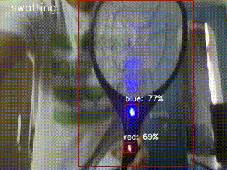
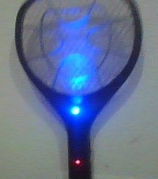
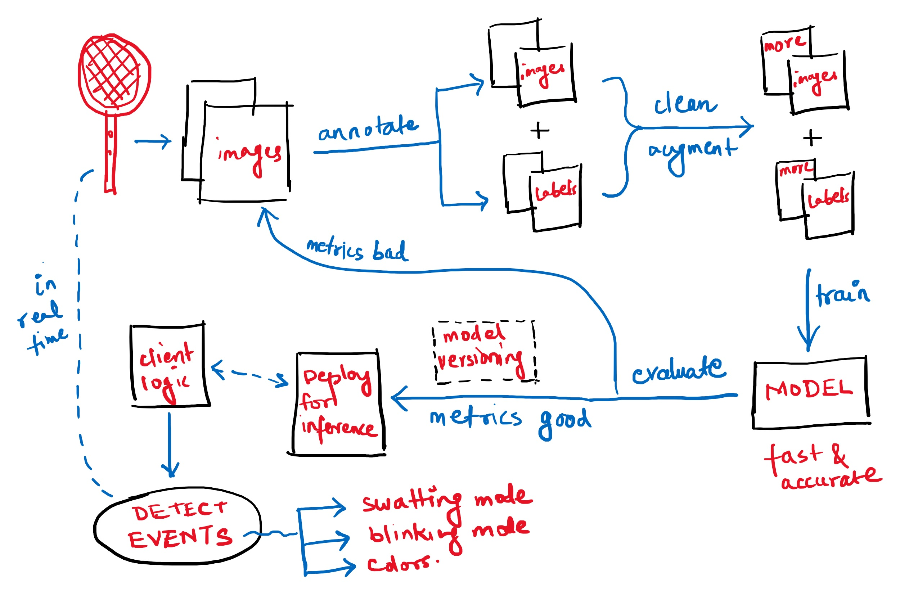
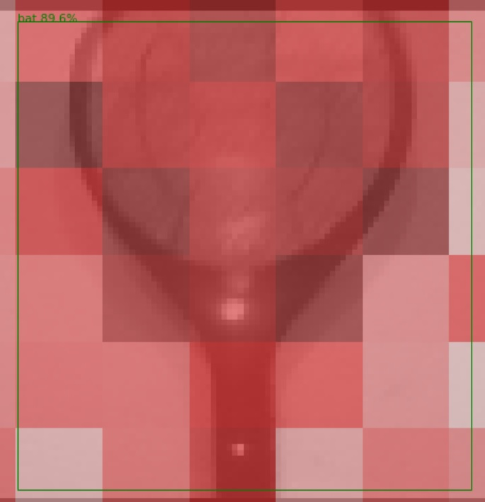

# real-time-video-analytics-recipe

This repo addresses a simplified use-case of event detection in videos using computer vision and deep learning. This recipe can easily be scaled up and extended to address more complex scenarios. 

  

          <strong> Overview </strong>
  

 

Let's consider a minimal yet common scenario where one would like to detect certain __events__ from a live feed in __realtime__. Given the complexity of the event, the analytical solutions differ, but a vast majority of scenarios end up requiring ML based solutions, owing to the fact that ML can provide robust solutions that don't break altogether upon slight environmental/scenic changes.

---

### The Plot
Almost all of us have encountered and hated mosquitos at least once in our lifespan. Mosquito bats :tennis: are effective at the job they do and we will be tackling the problem of detecting certain toy events with this rather *odd* object :rofl:.

### Events
- __Swatting mode__ : There's a button on the side of the bat, which when pressed puts the bat into swatting mode and additionally lights a tiny red LED that indicates the same.
- __Blinking mode__ : The user can (for fun), press and release the swat button in quick successions, thereby making the red LED indicator flicker. 
- __Light colors__ : Additional to the red led, there exists a blue led as well which is solely for vision during the dark. This requirement is for detecting the colors of these illuminated LEDs on the bat.

These are really as unrealistic as a toy example can get, but as we shall see, the components needed to tackle these events are applicable to other realistic events.

---

  

          <strong> Solution </strong>
  

 

All the events discussed, require one to locate the illuminated LED on the bat (Object Detection to the rescue). That's a good start, but let's dive deeper into the solutions for each event. 
1. For the 1st event, it suffices to check if the red LED on the bat is illuminated or not. 
2. For the 2nd event, we need to check if the red LED has been *alternating* between on and off states in a certain time duration. 
3. Finally, for the 3rd requirement, all we need to do is detect the colored LEDs separately. We can label the classes separately for each color and use the OD model to give us the colors, but any new addition or changes in the LED color would require retraining. A better approach would be to use OD just to get the illuminated LEDs and then use CV for identifying the colors of these regions. Easy!

We can now list the steps needed as follows:
- Dataset preparation
   - Data creation
   - Data annotation
   - Data curation
   - Data augmentation (if needed)
- Training
   - Model selection
   - Baseline
   - Adjustments & Tuning
- Versioning
   - Model evaluation
   - Artifacts storage
- Deployment
   - Serving framework selection
   - Latency check
- Inference
   - Pre and post processing
   - End-to-End tests
- Explainability (Optional)
   - SHAP / LIME

---

  

          <strong> Implementation </strong>
  

 

Some key takeaways from experience while working through these components.

### Dataset
In this toy example, I will be using my webcam as the source. Having set my cam resolution to __640x360__ (width, height), creating a small dataset was the initial step, followed by using [MakeSenseAI](https://www.makesense.ai/) for labelling these images. *Curation* and *augmentation* of data are steps that are taken after initial model selection and feasibility evaluation.   

Curation involved renaming files and removing spaces. Also, images without any annotations (helps to improve model precision) when exported from MakeSenseAI do not come with corresponding label files, so empty files had to be created for these cases.   

For offline augmentation, [imgaug](https://imgaug.readthedocs.io/en/latest/) is a popular library. Also, [albumentations](https://albumentations.ai/) is another fast and good one. I went ahead with imgaug because of prior experience in using this.

### Model
The choice of model is an important one. I started with SSD (fast and accurate) but realized quickly that it doesn't work that well for small objects and the LEDs in our datasets are small objects indeed. For real-time use cases, there are really SSD and YOLO as SOTAs, (Transformer based models are catching up at the time of writing this). Among YOLO based architectures, there was really YOLOR, YOLOX and YOLOV5 that had good implementations and they all are really close in terms of performance.

I went with the PyTorch implementation of [YOLOV5](https://github.com/ultralytics/yolov5) as it was much better documented and had a much easier API to work on custom datasets.

### Training
- __Create a baseline model__ : For this, fine tuning with a small network such as YOLOV5 nano (pretrained on COCO dataset) works well.
- __Train from scratch__ : Before diving into optimization world, training from scratch is smarter (given adequate compute).
- __More data__ : Deep networks are hungry for more data as they quickly overfit (especially small sized custom datasets). Often, annotating is a pain, so one can use augmentations or GANs to generate more data.
- __Strong validation set__ : A bad validation set can stray you off from a performant model. It need not be the 80-20 split, but a carefully created validation set goes a long way.
- __Hyperparameter tuning__ : Last but not the least, good hyperparameters help squeeze out better metrics. In our case, since the dataset is small and we were training on relatively small sized networks, toning down on the online augmentations and scaling helped. Also, because of small objects in our dataset, training on slightly higher resolutions help. In my case, training was done one 640x640 (original was 640x360).
- __Evaluation__ : Mean Average Precision (mAP) is the standard metric of choice for Object Detection models.

### Deployment
For deployment, we have quite a few options. Once can create a Flask REST API with the model loaded up and expose the endpoints for inference. Alternatively, we use serving options provided by Tensorflow and PyTorch i.e [TF Serving](https://github.com/tensorflow/serving) and [TorchServe](https://github.com/pytorch/serve) respectively. I went with TorchServe as YOLOV5 can export model in torchscript format.

A common setup involves spinning up the serving container with the saved model, adding some warmup images, exposing the endpoints for inference and having model handler scripts set up (that will perform model specific pre and post processing).

### Inference
Inference and event detection logic can be coded as independent components. Our requirements involve straightforward OpenCV applications to detect such events using bounding boxes detected from the model. To stay within real-time latencies, the codebase needs to be *lightweight* and often libraries like __numpy__ and __multiprocessing__ is used to speed up this part of the pipeline.

### Explainability
For general image classfication, torchserve has Captum integrations, but for object detection, there's nothing out of the box. __SHAP__ has **KernelExplainer** that is model agnostic and that's what I ended up using. A very convenient reference with YoloV5 can be found out at this [blog](https://www.steadforce.com/blog/explainable-object-detection) 

---

 

This recipe was centered around object detection, but it can easily be swapped / ensembled with other models, all depending on the problem one needs to tackle. With this simple yet effective design, a quick prototype model can be deployed and indeed scaled up to real systems wherein one would containerize the components that we had in this recipe and slap more features on it.

## Contributing
Pull requests are welcome. For major changes, please open an issue first to discuss what you would like to change.

## License
[Standard MIT](https://choosealicense.com/licenses/mit/)